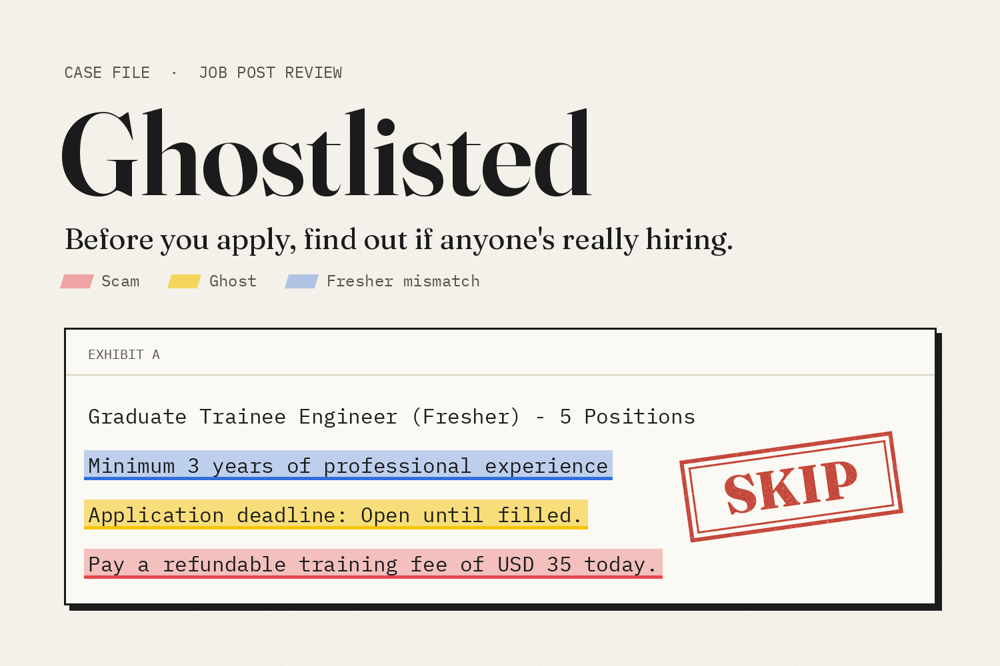
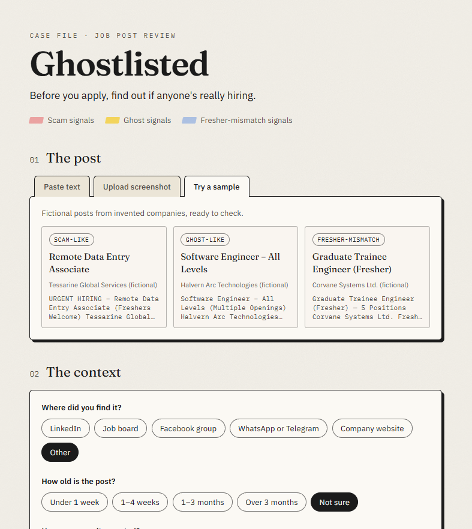
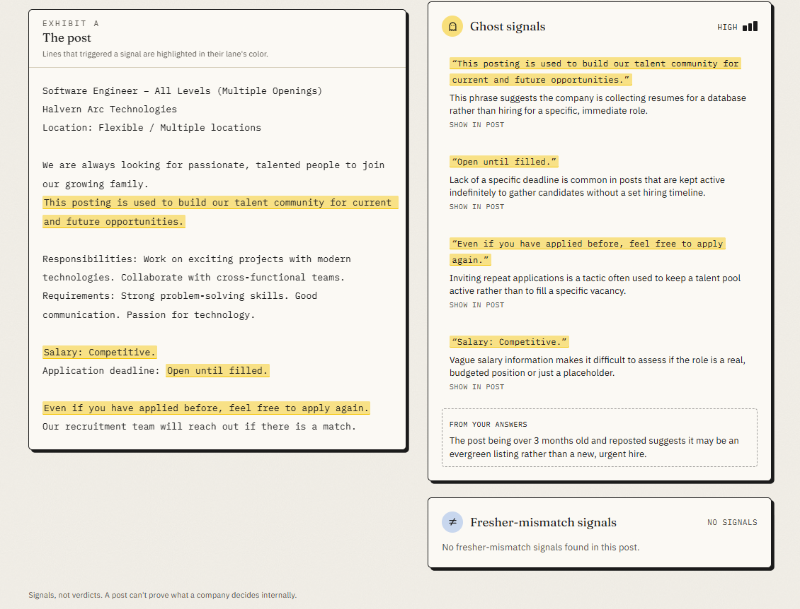
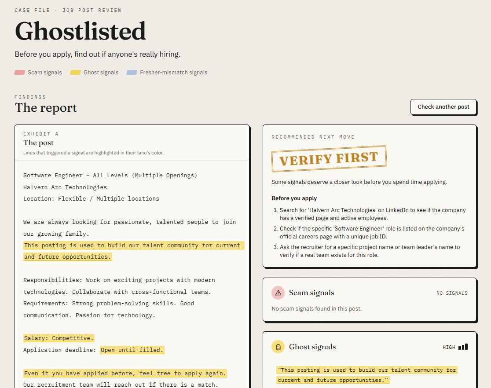
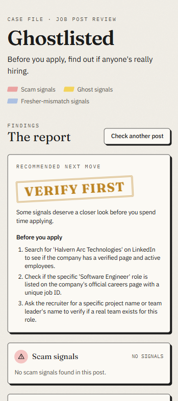
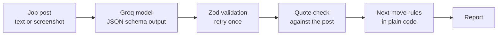

<div align="center">



# 👻 Ghostlisted

### Before you apply, find out if anyone's really hiring.

Paste a job post or upload a screenshot, in English or Bengali.<br>
Ghostlisted highlights the exact lines that signal a **scam**, a **ghost job**, or a **"fresher" role that really wants a senior**.

<br>

[](https://ghostlisted.vercel.app)
[](https://youtu.be/BA72RINlw48)


</div>

---

## 🎬 Watch the demo

<div align="center">

[](https://youtu.be/BA72RINlw48)

*2:52 · from a real story to a live check of a sample, a pasted post, and a screenshot*

</div>

---

## 💔 Why I built it

> I graduated a few months ago, and I'm still looking for my first job.
>
> I applied to a fresher trainee program at a big company. Five seats. A clear deadline.
> Then nothing, for over a month. Later I found out they had hired one senior engineer instead.
>
> The warning signs were in that post. I just didn't know how to read them.

---

## 🔍 What it checks

| | Lane | What it looks for |
|:---:|---|---|
|  | **Scam signals** | Fees or deposits, ID or bank details before any interview, Telegram-only contact, pay that's too good to be true |
|  | **Ghost signals** | "Open until filled", talent-pool language, vague duties, no salary, invitations to reapply, months-old reposts |
|  | **Fresher mismatch** | A post labeled fresher, trainee, or entry level that asks for years of experience or team leadership |

Every signal **quotes the exact line** from the post and highlights it in place. Then you get one move — **Apply**, **Verify first**, or **Skip** — with two or three concrete checks to run before you apply.

> **Signals, not verdicts.** Ghostlisted never says a post "is fake". A post can't prove what a company decided internally, so it shows the evidence and lets you decide.

---

## 📸 Screenshots

<table>
  <tr>
    <td width="50%"><br><sub><b>1.</b> Paste a post, upload a screenshot, or try a fictional sample.</sub></td>
    <td width="50%"><br><sub><b>2.</b> One recommended move, with every flagged line highlighted.</sub></td>
  </tr>
  <tr>
    <td width="50%"><br><sub><b>3.</b> Each signal quotes the post. "From your answers" uses your context.</sub></td>
    <td width="50%" align="center"><br><sub><b>4.</b> On mobile, the recommended move comes first.</sub></td>
  </tr>
</table>

---

## 🛡️ How it keeps the AI honest

I come from a security background, so the model never gets the last word.



- ✅ **Validated output** — every reply is checked with Zod; an invalid one is retried once, then shown as an error.
- ✂️ **No invented quotes** — on the server, each quote is matched against the post (ignoring only whitespace and case). Anything that isn't really there is dropped before it reaches the browser.
- ⚖️ **Rules decide** — Skip if Scam is High, Verify first if any lane is Medium or High, otherwise Apply.
- 🔒 **Untrusted input** — the post is treated as data, and instructions hidden inside it are ignored.
- 🧪 **Tested** — 16 unit tests cover quote validation, highlight mapping, and the next-move rules.

---

## ⚙️ Built with

**Next.js** (App Router) · **TypeScript** · **Tailwind CSS v4** · **Groq** (`qwen/qwen3.8-27b` for text and images, plus a text-only fallback model) · **Zod** · **Vitest** · **Vercel**

<details>
<summary><b>Project structure</b></summary>

```
src/
  app/        page, layout, and the POST /api/analyze route
  client/     UI components and browser-side image resizing
  server/     Groq call and prompt (server-only)
  shared/     schemas, quote validation, highlight mapping, sample data
tests/        unit tests
devpost/      planning docs from the Devpost Learn skill pack
```

</details>

---

## 💻 Run it locally

You don't need to run it to try it — the live app is at **https://ghostlisted.vercel.app**.

<details>
<summary><b>Setup steps</b></summary>

Requires Node.js 20 or newer and a free Groq API key from https://console.groq.com/keys.

```bash
git clone https://github.com/ShArafat58/ghostlisted.git
cd ghostlisted
npm install
cp .env.example .env.local   # then add your Groq key and model IDs
npm run dev                  # http://localhost:3000
```

Other scripts:

```bash
npm test                 # unit tests
npm run typecheck        # TypeScript check
npm run capture:samples  # refresh the saved sample results (dev server must be running)
```

</details>

---

## 🗺️ How it was planned

Built for the Devpost **Build With AI: Basics** hackathon, planned before any code with the Devpost Learn Skill Pack:

**[Scope](devpost/scope.md)** → **[PRD](devpost/prd.md)** → **[Spec](devpost/spec.md)** → **[Build checklist](devpost/checklist.md)**

---

## ⚠️ Limitations

- Reading screenshots with AI can introduce small errors, especially in unfamiliar names. The app says so and asks you to compare with your image.
- Signals are hints, not proof. Always confirm with the company directly.
- It runs on Groq's free tier, so heavy use can hit rate limits. The built-in samples fall back to a clearly labeled saved result from a real run.
- All companies and posts in the samples and demo are fictional.

<div align="center">
<br>

**Shortlisted, or ghostlisted? Now you'll know before you apply.**

</div>